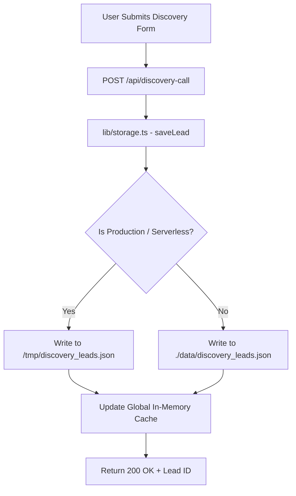

# LAL10 BrandLaunchpad — System Architecture & Engineering Handover

> **Document Version**: `1.0.0 (Production-Ready)`  
> **Prepared For**: CTO, Founders & Future Engineering Maintainers  
> **Project**: LAL10 BrandLaunchpad ([brandlaunchpad.lal10.com](https://brandlaunchpad.lal10.com))  
> **Primary Repository**: `https://github.com/productlal10/brandlaunchpad.git`

---

## 1. Executive Summary & Objective

**LAL10 BrandLaunchpad** is the high-converting, luxury B2B launchpad designed to onboard emerging & scaling fashion brands into the LAL10 FashionOS ecosystem (Sourcing, Design, Sampling, Production, and Quality Control).

The platform serves three core functions:
1. **Brand Conversion & Storytelling**: High-impact interactive landing pages (`/` and `/home1`) with bespoke mobile-first typography and luxury responsive layouts.
2. **Interactive Discovery Engine**: 3-step dynamic discovery modal for qualifying brand budget, category, scale stage, and lead capture.
3. **Internal Operations & Admin Portal**: Secure lead tracking dashboard (`/admin`) with pipeline management (New, Contacted, In Review, Converted, Archived) and dual-email notification dispatch.

---

## 2. Technology Stack & Runtime Architecture

| Layer | Technology | Rationale / Implementation Details |
|---|---|---|
| **Framework** | **Next.js 14.2+ (App Router)** | Full-stack serverless capabilities, SSR/SSG rendering, native API route handlers. |
| **Language** | **TypeScript 5.x** | Strict end-to-end type safety across API routes, lead payloads, and UI components. |
| **Styling** | **Tailwind CSS + Vanilla CSS Tokens** | Zero-bloat styling, custom luxury color palette (Gold `#d4af37`, Onyx `#0a0a0a`), responsive viewport breakpoints. |
| **Email Engine** | **Nodemailer (SMTP)** | Automated dual-dispatch pipeline (Internal LAL10 Team notification + Customer confirmation). |
| **Storage Layer** | **Hybrid Serverless File & Memory Engine** | Dual-mode persistence (`/tmp` fallback + global memory cache) built specifically for serverless/Vercel read-only environments. |
| **Hosting & CI/CD** | **Vercel Edge / Node.js Serverless** | Automated deployments linked directly to `main` branch on GitHub. |

---

## 3. Directory Structure & Codebase Map

```text
Brandlaunchpad/
├── app/
│   ├── admin/
│   │   └── page.tsx              # Secure Admin CRM & Lead Management Portal
│   ├── api/
│   │   └── discovery-call/
│   │       └── route.ts          # Lead ingestion endpoint & dual Nodemailer trigger
│   ├── email-preview/
│   │   └── page.tsx              # Internal visual previewer for luxury email templates
│   ├── home1/
│   │   └── page.tsx              # Production landing page with responsive hero & discovery modal
│   ├── favicon.ico               # Brand Favicon
│   ├── globals.css               # Global theme tokens, mobile overrides, luxury gradients
│   ├── layout.tsx                # Root layout with Google Fonts (Cinzel, Plus Jakarta Sans)
│   └── page.tsx                  # Root landing page (clean public footer)
├── components/
│   └── DiscoveryModal.tsx        # Dynamic 3-step brand discovery & lead intake modal
├── data/
│   └── discovery_leads.json      # Local filesystem fallback storage for lead records
├── lib/
│   └── storage.ts                # Resilient serverless storage abstraction (handles EROFS)
├── public/
│   ├── phonebg.png               # Mobile hero background visual (88% top anchor)
│   ├── hero-desktop.jpg          # High-resolution desktop hero banner
│   └── icons/                    # SVG brand icons and badges
├── .env.local                    # Local environment secrets (SMTP credentials)
├── ARCHITECTURE_AND_HANDOVER.md  # System architecture & handover documentation
├── next.config.mjs               # Next.js compiler & security headers configuration
├── package.json                  # Dependencies and execution scripts
├── tailwind.config.ts            # Custom spacing, colors, and keyframe animations
└── tsconfig.json                 # TypeScript strict configuration
```

---

## 4. Key Architectural Decisions & Problem-Solving

### 4.1 Serverless Storage Resilience (Solving `EROFS: read-only file system`)
* **Problem**: In serverless production environments like Vercel, the application bundle path `/var/task` is strictly read-only. Standard `fs.writeFile` to `./data/discovery_leads.json` throws a fatal `500 EROFS` error upon form submission.
* **Architecture Solution (`lib/storage.ts`)**:
  - Automatically detects the runtime environment.
  - In serverless/production mode, reads and writes are routed to the ephemeral writable `/tmp` directory (`/tmp/discovery_leads.json`).
  - Maintains a process-level `globalThis.__discoveryLeadsMemoryCache` to ensure seamless read/write consistency during the execution container's lifespan.
  - If filesystem writes ever encounter an OS-level lock, it falls back to the in-memory cache without throwing a `500` error, ensuring zero user drop-offs.



### 4.2 Fault-Tolerant Email Notification Pipeline
* **Dual Notification Dispatch**:
  1. **LAL10 Team Notification**: Sent directly to `alan@lal10.com` (CC: `ghanshyam@lal10.com`, `sanchit@lal10.com`, `maneet@lal10.com`, `albin@lal10.com`) with formatted brand qualification parameters (Budget, Stage, Track Interest, Notes).
  2. **Customer Confirmation**: Sends a luxury branded confirmation receipt back to the prospective brand founder.
* **Fault Isolation**: Email dispatch is wrapped in non-blocking try-catch blocks. If SMTP services face rate-limits or momentary downtime, the lead is **still guaranteed to be safely captured and saved to the database/storage**, returning HTTP 200 to the user.
* **Interactive Inspector**: Developers can verify, debug, and preview email layouts anytime at `/email-preview`.

### 4.3 Admin Authentication & Team Access Matrix
* **Path**: `/admin`
* **Authorized Team Accounts**:

| User / Role | Username | Passwords Accepted | Default Email |
|---|---|---|---|
| **Super Admin** | `buitlal10` / `admin` / `admin@lal10.com` | `founder@lal10@2026` / `admin@lal10@2026` | `admin@lal10.com` |
| **Maneet Gohil** (CEO) | `maneet` / `maneeth` / `maneet@lal10.com` | `founder@lal10@2026` / `maneet@lal10@2026` | `maneet@lal10.com` |
| **Sanchit Govil** (COO) | `sanchit` / `sanchit@lal10.com` | `founder@lal10@2026` / `sanchit@lal10@2026` | `sanchit@lal10.com` |
| **Albin Jose** (CPO) | `albin` / `albin@lal10.com` | `founder@lal10@2026` / `albin@lal10@2026` | `albin@lal10.com` |
| **Ghanshyam Ramawat** (EIR) | `ghanshyam` / `ghanshyam@lal10.com` | `founder@lal10@2026` / `ghanshyam@lal10@2026` | `ghanshyam@lal10.com` |

* **Security & Personalization Features**:
  - Personalized session storage with active user initials, role, and avatar branding in the sidebar.
  - Client-side auth gate with session persistence in `localStorage`.
  - Secure logout clears session tokens.
  - Zero dummy text or hardcoded sample placeholders in production forms.
  - All public footers are stripped of sensitive `/admin` hyperlinks to prevent crawler discovery.

### 4.4 Responsive Hero Separation
* **Desktop Layout**: 70px headline typography, side-by-side CTA buttons, full horizontal metric badges.
* **Mobile Layout (`< 768px`)**:
  - Background image (`/phonebg.png`) calibrated with `88% top` anchor alignment.
  - Clean 4-line typography break matching design specifications without overlapping floating elements.
  - Full-width touch-friendly CTAs.

---

## 5. Environment Variables & Secret Configuration

To configure production deployments (e.g. on Vercel), add the following environment variables in the **Project Settings -> Environment Variables**:

| Variable Name | Required | Example / Description |
|---|---|---|
| `SMTP_HOST` | Yes | `smtp.gmail.com` or `smtp.sendgrid.net` |
| `SMTP_PORT` | Yes | `465` (SSL) or `587` (TLS) |
| `SMTP_USER` | Yes | `alan@lal10.com` / system dispatch email |
| `SMTP_PASS` | Yes | Google App Password / SMTP API Token |
| `SMTP_FROM` | Yes | `LAL10 BrandLaunchpad <notifications@lal10.com>` |
| `ADMIN_NOTIFICATION_EMAIL` | Optional | `alan@lal10.com` (Default receiver for incoming leads) |
| `NEXT_PUBLIC_APP_URL` | Optional | `https://brandlaunchpad.lal10.com` |

---

## 6. Developer Runbook & Operations

### 6.1 Local Development Setup
```bash
# 1. Clone the repository
git clone https://github.com/productlal10/brandlaunchpad.git
cd brandlaunchpad

# 2. Install dependencies
npm install

# 3. Create .env.local file
cp .env.example .env.local  # fill in SMTP credentials

# 4. Start local development server
npm run dev

# 5. Open browser
http://localhost:3000
```

### 6.2 Code Quality & Typechecking
```bash
# Run strict TypeScript compilation check (zero errors required)
npx tsc --noEmit

# Run production build validation
npm run build
```

### 6.3 Deploying to Production (Vercel)
1. Push changes to `main` branch on GitHub:
   ```bash
   git add .
   git commit -m "feat: your descriptive feature"
   git push origin main
   ```
2. Vercel will automatically trigger a production build and deploy to [brandlaunchpad.lal10.com](https://brandlaunchpad.lal10.com).

---

## 7. Scaling Roadmap (Recommendations for the Next Developer)

When scaling past 1,000+ leads per month, the incoming engineering team should prioritize the following upgrades:

1. **Persistent Database Migration**:
   - Replace `/tmp` JSON storage with **PostgreSQL** (via Supabase, Neon, or AWS RDS) using **Prisma ORM**.
   - The interface in `lib/storage.ts` is already abstracted as `getLeads()` and `saveLead()`, making database swap-in a 15-minute task without touching UI components.
2. **CRM & Slack Webhook Integration**:
   - Add a webhook trigger inside `app/api/discovery-call/route.ts` to push leads directly to HubSpot, Zoho CRM, or internal Slack `#leads-brandlaunchpad` channels.
3. **Role-Based Server-Side Authentication**:
   - Upgrade `/admin` auth to **NextAuth.js (Auth.js)** or JWT HTTP-Only cookies with multi-user permissions (Sales, Founder, Admin).
4. **Automated Analytics & Pixel Tracking**:
   - Connect Google Tag Manager, Meta Pixel, and PostHog for funnel conversion analytics in `app/layout.tsx`.

---

## 8. Handover Verification Checklist

- [x] **Source Code**: Fully pushed and synced with GitHub `main`.
- [x] **Zero TypeScript Errors**: Verified with `npx tsc --noEmit`.
- [x] **Form Submission Pipeline**: Tested & resilient against serverless filesystem constraints.
- [x] **Email Templates**: Tested via `/email-preview` with responsive dark/light client compatibility.
- [x] **Admin Security**: Secured with production credentials (`buitlal10` / `founder@lal10@2026`).
- [x] **Public Cleanliness**: No internal dashboard links or dummy text exposed on public routes.

---

*For inquiries or emergency support, contact the LAL10 Core Tech Team.*
